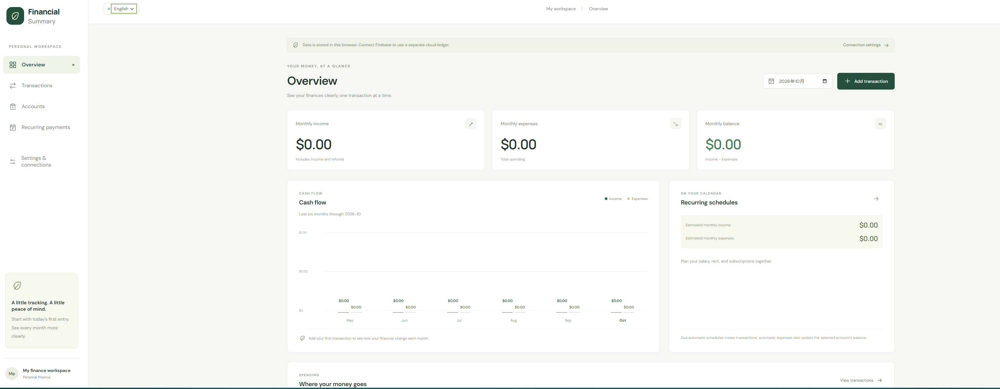

# Financial Summary

个人财务管理网站，支持本地账本、虚构演示数据和可选的 Firebase 云端账本。

**技术栈：** React · TypeScript · Vite · Firebase



## 功能

- 月度收支、分类统计、资产与负债概览。
- 交易管理、CSV 导出和固定收支计划。
- Chase 文字型信用卡 PDF 导入与核对。
- 中英文界面，适配桌面和手机；可选 Google 登录与云端保存。

## 快速开始

使用 Node.js 24。**本地账本和演示模式不需要任何 API key。**

```sh
git clone https://github.com/catflyx520/FinancialSummary.git
cd FinancialSummary
npm ci
npm run dev
```

打开终端显示的地址即可使用。演示数据不写入真实账本；本地账本只存于当前浏览器，不会自动同步到云端。

顶部的 **中文 / English** 可切换界面语言，并自动记住选择；账本内容和正在填写的表单不会因切换语言而重置。

## 云端配置（可选）

将根目录的 `.env.example` 复制为 `.env.local`，填写自己的 Firebase Web 配置：

```dotenv
VITE_FIREBASE_API_KEY=
VITE_FIREBASE_AUTH_DOMAIN=
VITE_FIREBASE_PROJECT_ID=
VITE_FIREBASE_APP_ID=
```

PowerShell：`Copy-Item .env.example .env.local`；macOS/Linux：`cp .env.example .env.local`。

还需开启 Google 登录、设置 `ownerUid` 并部署 Firestore rules，步骤见 **[Firebase 配置指南](FIREBASE_SETUP.md)**。修改配置后重启开发服务，发布版本需重新构建。

`.env.local` 已被 Git 忽略。Firebase Web 配置会进入前端产物，不要填入服务账号私钥或其他服务的秘密 key。

## 使用与开发

- [使用说明与限制](USAGE.md)：记账和余额规则、PDF 支持范围、常见问题。
- [架构说明](ARCHITECTURE.md)：数据结构与权限规则。

```sh
npm test -- --run
npm run build
npm run lint
npm run test:rules # Firestore 模拟器，需要 Java 21+
```
